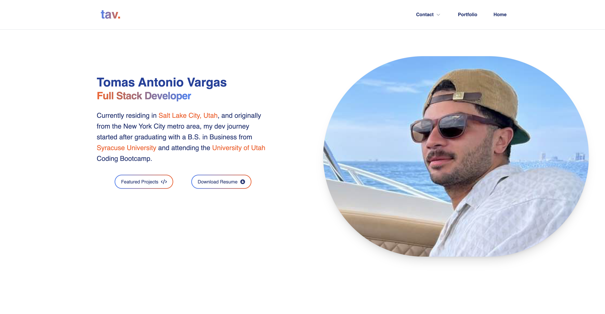

# React Portfolio (v1.0)
[](https://opensource.org/licenses/MIT)
[](https://app.netlify.com/sites/tavargas/deploys)
[](https://react.dev/)
[](https://tailwindcss.com/)
[](https://netlify.app/)
[](https://reactrouter.com/en/main)
[](https://nodejs.org/)


## Description

My personal portfolio website made with React

## Table of Contents

- [Description](#Description)
- [Installation](#Installation)
- [Usage](#Usage)
- [License](#License)
- [Contributing](#Contributing)
- [Tests](#Tests)
- [Technologies Used](#Technologies-Used)
- [Questions](#Questions)
- [Credits](#Credits)

## Installation

To access this project locally, clone or fork the repository. Open in you IDE of choice and head to the terminal. You will need ```Node.js``` installed globally on your machine. Run ```npm install``` to install dependencies. Run ```npm start``` to get the project running locally. It will run in development mode on ```PORT: 3001```. Open http://localhost:3001 to view in the browser.

## Usage



Head to ```/src/components/``` in the project directory to view and edit each individual component. Navigate to ```/src/pages/``` to view each individual page.

## License 

This project is available under the MIT license. See [LICENSE](./LICENSE) for more info.

## Contributing

Fork or clone this repository to your local machine. Open a GitHub issue discribing your intended contribution or any bugs. Create a pull request before merging. Happy coding!


## Technologies Used

React.js, Node.js, Vite, JavaScript, HTML, CSS, Tailwind, Material UI, Flowbite, and is deployed through Netlify.

## Questions

If there are any questions, feel free to reachout to me on [GitHub](https://github.com/tavargas9), or send me an [email](mailto:tavargas9@gmail.com).

## Credits

This README was generated using [README Generator](https://github.com/tavargas9/README-generator) created by [Tomas Vargas](https://github.com/tavargas9).
